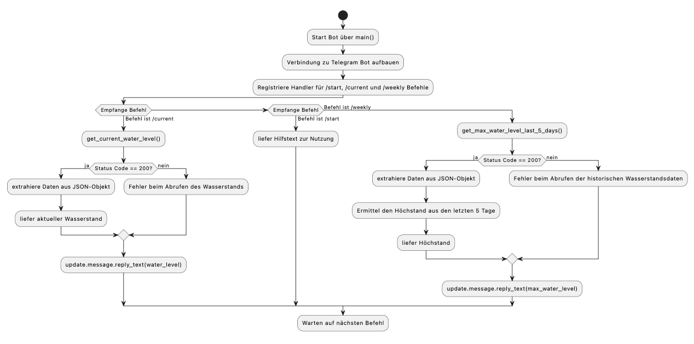

# Wasserpegel
This project is a Telegram bot designed to provide real-time water level updates for the Rhine River at Bonn. By leveraging data from the official Pegel Online API, the bot offers insights into current water levels and historical trends. It is packaged in a lightweight Docker container for ease of deployment and is intended to include CI/CD pipelines for streamlined updates and task automation.

## Prerequisites
-Python 3.x installed on your system

-Telegram account

-Docker

## Getting started

### Create a Telegram Bot Using BotFather

1. Open Telegram and search for BotFather.
2. Start a chat with BotFather and use the command /newbot .
3. Follow the prompts to
   
     -Give your bot a name.
  
     -Assign it a unique username ending in bot.
  
5. Once created,you will receive a token that looks like this: 123456789:ABCdefGhIJklMnoPQRstUVwXyZ123456789

Important: Keep this token secure, it grants controle over your bot.

### Set the token as an Environment Variable

For the bot to work locally or in a Docker container, you need to configure the token as an environment variable named TELEGRAM_TOKEN.

1. Local Development: Add the following line to your teminal:

	-export TELEGRAM_TOKEN="your-bot-token"

Replace your-bot-token with the token provided by BotFather.

2. Running in Docker: When running the bot in a Docker container, pass the token as an environment variable: 

	-docker run -e TELEGRAM_TOKEN="your-bot-token" your-docker-image

### Verify the Setup

1. After setting up, start the bot:

	Run the Python script locally:
 
	-python app.py

	Or start the Docker container:

	-docker build -t water-level-bot .

	-docker run -e TELEGRAM_TOKEN="your-bot-token" water-level-bot

You can now interact with your Bot by sending commands like /start, /current or /weekly in Telegram.

## Docker

### 1. Rund the Container

To start the bot, use the following command. Replace INSERT-TOKEN-HERE with your actual Telegram bot Token:

-dokcer run --name name -e TELEGRAM_TOKEN="INSERT-TOKEN-HERE" ghcr.io/username/repositoryname

### 2. Run the Container in the Background

To run the container in detached mode (in the background), add the -d flag:

-docker run -d --name name -e TELEGRAM_TOKEN="INSERT-TOKEN-HERE" ghcr.io/username/repositoryname

### 3. Build the Docker Image

If you are building the image locally from a Dockerfile, use:

-docker build -t your-image-name .

Replace your-image-name with a name for your image.

### 4. List Docker Images

To view all locally available Docker images, run:

-docker images

### 5. Remove a Docker Image 

To delete a specific Docker image by its ID or name, use:

-docker rmi image-id-or-name

Replace image-id-or-name with the images ID or name shown in the output of the docker images.

## Activity Diagram

